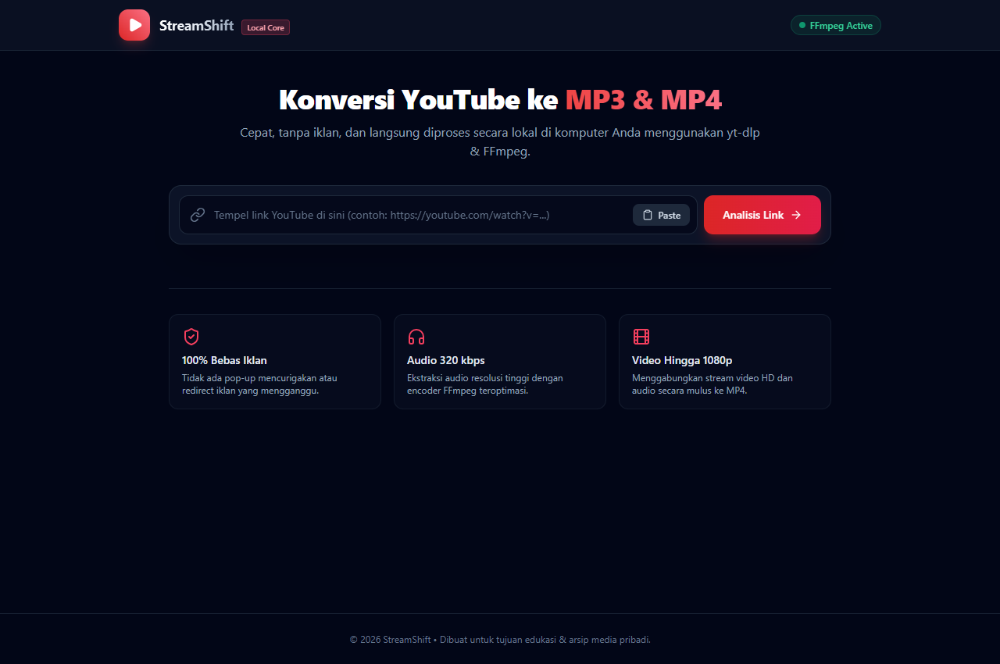

# 🎵 StreamShift — YouTube to MP3 & MP4 Converter (Local)

<p align="center">
  
  
  
  
  
</p>

<p align="center">
  
</p>

An ad-free, sleek, and high-performance local web application designed to convert and archive YouTube videos into **MP3 (Audio)** and **MP4 (Video)** with real-time download and conversion progress tracking.

---

## ✨ Features

- 🎧 **Audio Extraction (MP3):** Choose your preferred bitrate: **128 kbps**, **192 kbps**, or **320 kbps (Ultra High Quality)**.
- 🎬 **Video Conversion (MP4):** Dynamically detects available video resolutions: **360p, 480p, 720p HD, and 1080p Full HD**, cleanly merging video and audio streams via FFmpeg.
- ⚡ **Zero External Ads:** No popups, redirects, or malicious trackers common to public web converters.
- 📊 **Real-time Live Progress:** Interactive progress bar showing download percentage, download speed (MB/s), ETA, and FFmpeg post-processing status.
- 🎨 **Modern Dark UI:** Responsive glassmorphism interface built with Tailwind CSS and Lucide Icons, featuring an automatic clipboard paste button.
- 🧹 **Automatic Storage Cleanup:** Background worker removes temporary converted files older than 1 hour to save disk space.

---

## 🛠️ Tech Stack

- **Backend:** [FastAPI](https://fastapi.tiangolo.com/), [Uvicorn](https://www.uvicorn.org/)
- **Media Engine:** [yt-dlp](https://github.com/yt-dlp/yt-dlp), [imageio-ffmpeg](https://github.com/imageio/imageio-ffmpeg) (Standalone FFmpeg v7.1)
- **Frontend:** HTML5, Modern [Tailwind CSS](https://tailwindcss.com/), Vanilla JavaScript, [Lucide Icons](https://lucide.dev/)
- **Templates:** Jinja2

---

## 📁 Project Structure

```text
yt-converter/
├── app/
│   ├── main.py              # FastAPI server routes, API endpoints, & static mounting
│   ├── downloader.py        # yt-dlp wrapper, async background threads, & progress tracking
│   └── utils.py             # FFmpeg binary resolver, formatters, and auto-cleanup
├── static/
│   ├── css/style.css        # Custom UI transitions and component styles
│   └── js/app.js            # Frontend logic, API calls, and realtime progress polling
├── templates/
│   └── index.html           # Tailwind CSS glassmorphic user interface
├── downloads/               # Temporary storage for converted media files
├── .gitignore
├── preview.png              # UI Screenshot preview
├── requirements.txt         # Project Python dependencies
├── run.bat                  # 1-Click launcher for Windows
└── README.md
```

---

## 🚀 Quick Start (Local Setup)

### 1. Clone the Repository
```bash
git clone https://github.com/olyxmintabansos-byte/yt-converter.git
cd yt-converter
```

### 2. Install Dependencies
Make sure you have Python 3.10 or newer installed:
```bash
pip install -r requirements.txt
```
*(Note: `imageio-ffmpeg` automatically manages and delivers the standalone FFmpeg executable, so no manual FFmpeg PATH configuration is required!)*

### 3. Run the Application

**On Windows (1-Click):**
Double-click `run.bat` or run:
```bash
.\run.bat
```

**Via Terminal / Linux / macOS:**
```bash
python -m uvicorn app.main:app --host 127.0.0.1 --port 8000 --reload
```

Open your browser and navigate to:
👉 **`http://127.0.0.1:8000`**

---

## ⚠️ Disclaimer

This project is created strictly for **educational, personal study, and local media archiving purposes** (e.g., public domain or copyright-free content). Downloading copyrighted material from YouTube without permission violates YouTube's Terms of Service. The authors and contributors are not responsible for any misuse of this software.

---

## 📝 License

This project is open-source and licensed under the [MIT License](LICENSE).
